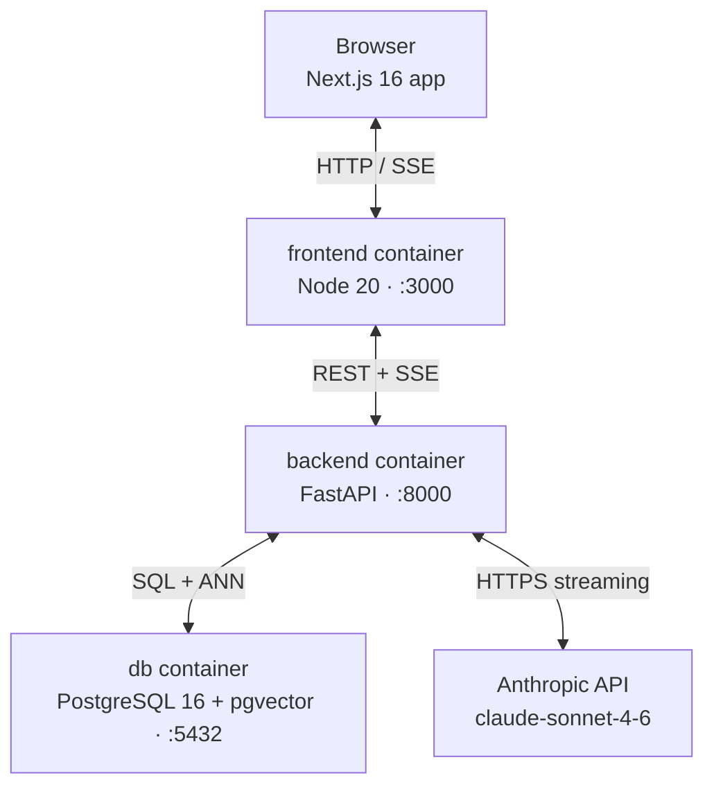
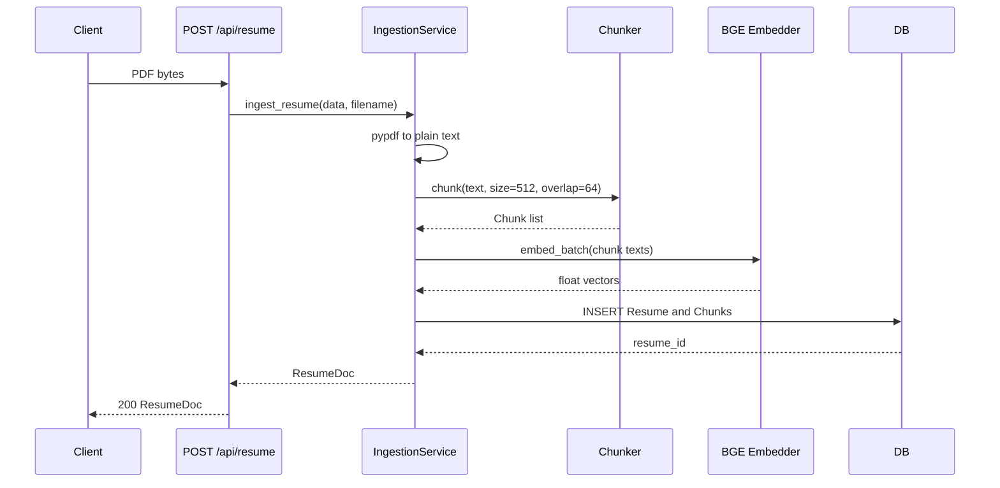
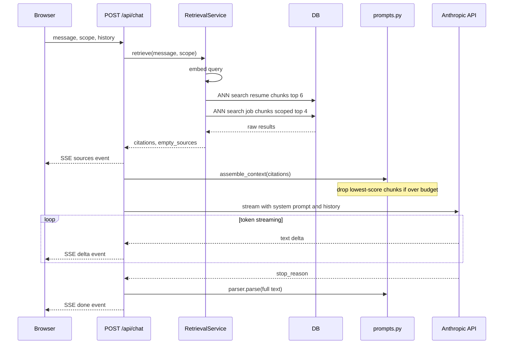
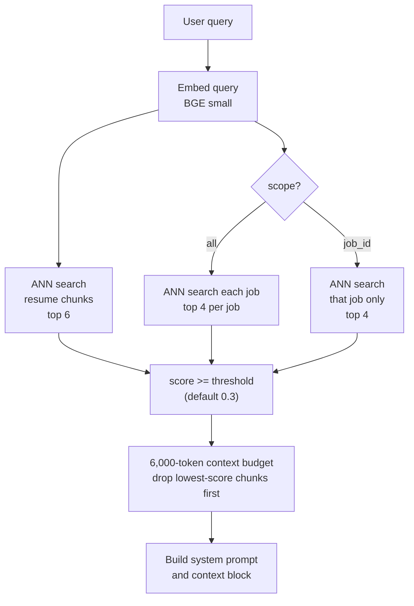
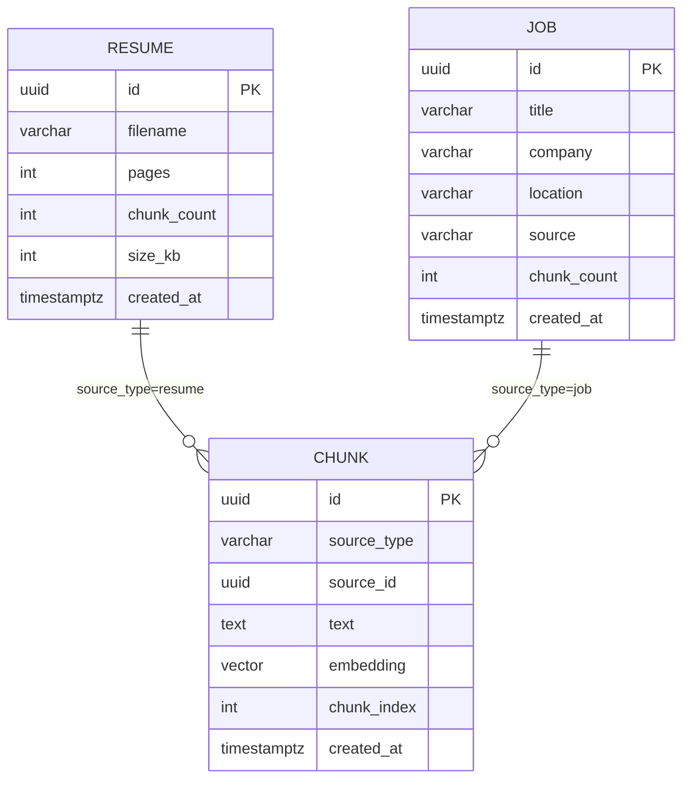

# Career Intelligence Assistant

Upload your resume and target job descriptions, ask the assistant how your experience aligns. Answers are grounded in your documents — the model cannot invent skills or employers that do not appear in the text.

<!-- STUB: Kousha fills this in — one paragraph on the motivation and what you learned building it -->

## Quick start

```bash
cp .env.example .env       # or create .env manually — see SETUP.md
# set ANTHROPIC_API_KEY in .env
./build.sh
```

The browser opens automatically at `http://localhost:3000`. See [SETUP.md](./SETUP.md) for prerequisites and troubleshooting.

---

## See it work

This is the exact sequence to demonstrate the app end-to-end.

1. **Open the app** at `http://localhost:3000`. The Setup screen shows two cards: Resume and Job Descriptions.

2. **Upload your resume.** Click the dashed upload area in the Resume card, pick a PDF. While the file is processing you see "Uploading…"; once it finishes the card switches to `resume.pdf · 3 pages · 18 chunks · PARSED`. The chunk count tells you how many passages are in the index.

3. **Add a job description.** Paste the full text of a job posting into the textarea and click "Add job description". The title and company are extracted automatically. The job appears as `01 — [Title] · [Company]` with a chunk count.

4. **Continue to chat.** The gate bar at the bottom shows "1 resume · 1 job description indexed and ready." Click **CONTINUE TO CHAT**.

5. **Ask a question.** Either click one of the four prompt suggestions on the empty state or type your own — something like "How well does my background match the requirements?" and press Enter.

6. **Watch retrieval happen.** The streaming panel cycles through three phases:
   - *Retrieving…* — the query is being embedded and ANN search is running
   - *Reading 5 sources…* — chunks have been retrieved; generation is about to start
   - *Generating answer…* — text is streaming from Claude

7. **Read the answer.** The response is structured in two to four sections with `## Heading` lines and bold-lead bullets. Each source that was cited appears as a chip below the question. Click a chip to expand the raw passage.

8. **Try a follow-up.** Conversation history is included in the context window, so the model can refer to what it said before. Note that retrieval does not rewrite the follow-up question — it embeds the raw follow-up text — so very short follow-ups ("what about Python?") may retrieve different chunks than the first question.

9. **Try the scope selector.** In the left rail, click a specific job to restrict retrieval to that job's chunks. The scope bar at the top confirms which job is active.

---

## Architecture

### System overview



All three services are defined in `docker-compose.yml`. The frontend container does not call the Anthropic API or the database directly.

### Ingestion sequence



### Chat sequence (SSE)



### Retrieval scoping



Two separate ANN queries run for every request: one against resume chunks, one against job chunks. A single global top-k would return only job-description text on verbose postings, leaving no evidence about the candidate.

### Database schema



`source_type` + `source_id` is a soft foreign key. There is no enforced FK constraint, which keeps the delete path simple: `ChunkRepository.delete_for_source` runs first, then `JobRepository.delete`, both committed in a single transaction by the service.

---

## How retrieval works

When a question arrives, the backend embeds it with the same BGE small model used at ingestion time. It then runs two separate cosine ANN searches: one against resume chunks (top 6 candidates) and one against job chunks (top 4 per job if scope is "all", or top 6 from a single job if a specific job is selected).

Results from both searches are filtered by a similarity floor — default 0.30 on a 0–1 cosine similarity scale. Chunks that score below the floor are discarded before the model sees them. Sources that produced zero passing chunks are noted explicitly in the context block so the model can say "no evidence found" rather than guessing.

Passing chunks are ranked by score. If they would exceed the 6,000-token context budget (estimated with `cl100k_base` as a proxy), the lowest-scoring chunks are dropped until the budget is met. The backend logs when truncation occurs; the frontend does not surface it to the user.

The assembled context is injected into the system prompt alongside a set of formatting rules, and the conversation history is passed as the messages array. History provides the model with conversational continuity, but the retrieval query is always the raw new message — there is no query rewriting to account for follow-up phrasing.

---

## API reference

### `POST /api/resume`

Upload a PDF resume.

```bash
curl -X POST http://localhost:8000/api/resume \
  -F "file=@resume.pdf;type=application/pdf"
```

```json
{
  "id": "f3a9e2b1-7c4d-4a8e-b2f1-9e3d5c6a7b8c",
  "filename": "resume.pdf",
  "pages": 1,
  "chunks": 1,
  "sizeKb": 0.8
}
```

### `POST /api/jobs`

Add a job from pasted text. Provide exactly one of `text` or `file`.

```bash
curl -X POST http://localhost:8000/api/jobs \
  -F 'text=Senior Frontend Engineer at Acme. We are looking for a React expert with 5+ years of experience...'
```

```json
{
  "id": "bc48850b-3208-4652-a349-16c33e108e33",
  "title": "Senior Frontend Engineer",
  "company": "Acme",
  "location": "",
  "source": "paste",
  "chunks": 1
}
```

### `GET /api/jobs`

List all indexed jobs.

```bash
curl http://localhost:8000/api/jobs
```

```json
[
  {
    "id": "c9948e4d-2c64-49f2-8cfa-fa0f355b44b7",
    "title": "Full-Stack AI Engineer",
    "company": "Perplexity",
    "location": "San Francisco (Hybrid)",
    "source": "paste",
    "chunks": 1
  }
]
```

### `DELETE /api/jobs/{id}`

Delete a job and all its indexed chunks. Returns 204 with no body on success.

```bash
curl -X DELETE http://localhost:8000/api/jobs/bc48850b-3208-4652-a349-16c33e108e33 \
  -w "HTTP %{http_code}"
# → HTTP 204
```

Non-existent ID:

```json
{"detail":"Job 00000000-0000-0000-0000-000000000000 not found."}
```

### `POST /api/chat`

Stream a response as Server-Sent Events.

```bash
curl -X POST http://localhost:8000/api/chat \
  -H "Content-Type: application/json" \
  -d '{"message":"What are the main technical skills?","scope":"all","history":[]}'
```

The response is a newline-delimited SSE stream. Each frame is `data: {...}\n\n`.

```
data: {"type":"sources","citations":[{"id":"...","kind":"Resume","label":"Jane Smith","score":0.58,"locator":"Page 1 · chunk 1 of 1","chunk":"Senior Software Engineer with 5 years..."},...]}

data: {"type":"delta","text":"## Technical Skills\n\n"}

data: {"type":"delta","text":"Based on the resume, the main skills are:"}

data: {"type":"done","sections":[{"heading":"Technical Skills","paragraph":"...","bullets":[...]}],"footer":{"latencySeconds":8.56,"tokens":2678,"costDollars":0.0125,"model":"claude-sonnet","chunks":5,"truncated":false}}
```

`sources` fires before generation begins. The frontend uses it to switch from "Retrieving…" to "Reading N sources…". `done` contains the fully parsed answer alongside billing metadata.

### `GET /health`

```bash
curl http://localhost:8000/health
# → {"status":"ok"}
```

### `GET /api/metrics`

In-process counters. Resets on container restart.

```bash
curl http://localhost:8000/api/metrics
```

```json
{"request_count":0,"p50_latency_seconds":0.0,"p95_latency_seconds":0.0,"total_tokens":0,"total_cost_dollars":0.0}
```

---

## Project structure

```
career-intelligence-assistant/
├── build.sh              one-command build, test, and launch
├── SETUP.md              prerequisites and troubleshooting
├── docker-compose.yml
├── .env                  (not committed — see SETUP.md)
├── backend/
│   ├── Dockerfile
│   ├── pyproject.toml
│   ├── README.md
│   └── app/              see backend/README.md
└── frontend/
    ├── README.md
    └── src/              see frontend/README.md
```

---

## Testing

### Backend

```bash
docker compose run --rm --no-deps backend sh -c "PYTHONPATH=/app pytest tests/ -q"
```

8 test files. The `Embedder` protocol is satisfied by a deterministic fake; the Anthropic client is mocked at the SDK boundary. No live database, no network calls.

**Covered:** chunk boundaries and overlap, context budget truncation, retrieval per-source budgets and scope logic, markdown parser for all section types, route contracts (status codes, response shapes, 422 on bad input, 404 on missing job), guardrail rejection, daily token budget enforcement, metrics accumulation.

**Not covered:** the embedder itself (it calls a real model; the protocol boundary means tests inject the fake instead), the Claude client beyond the mock boundary, end-to-end SSE frame ordering, and resume upload with a real PDF (tested manually).

### Frontend

```bash
cd frontend && npm test
```

23 test files, 31 tests. Components with API calls use `vi.mock("@/lib/api")`. `DocumentsProvider` accepts `initialJobs` to skip the `listJobs()` fetch in tests.

**Covered:** component rendering across all states (empty, uploading, error, populated), user interactions (upload, paste, remove, submit, stop), streaming message phase transitions (Retrieving / Reading / Generating), chat screen state machine (idle → streaming → thread → error), scope bar and document rail rendering.

**Not covered:** the SSE client itself (network-level streaming is hard to test hermetically without a real server), end-to-end browser flow, and the Fit screen (not implemented).

---

## Known limitations

1. **pypdf loses whitespace between layout columns.** Multi-column PDF resumes are concatenated without spaces, producing fused tokens ("LeadEngineer" instead of "Lead Engineer"). Retrieval finds no matches for those fused tokens, so the model reports missing evidence for skills that are present in the document. Fix: switch to `pdfplumber` or `pymupdf`.

2. **No authentication or user isolation.** Any HTTP client can read, upload, or delete any document. A second browser tab shares state with the first because there is no user concept in the database schema. Fix: add an auth layer (e.g., Clerk) and a `user_id` FK on every table.

3. **Clearing the resume removes it from the UI only.** `clearResume()` updates local state; there is no `DELETE /api/resume` endpoint. The chunks remain indexed and are still retrieved and cited in subsequent chat turns even though the resume tile no longer appears in the sidebar.

4. **Follow-up questions are not rewritten for retrieval.** Conversation history is included in the prompt so the model has context, but the retrieval query is the raw new message. A follow-up like "what about their Python skills?" embeds as-is; the ANN search returns results for "Python skills" without knowing the conversation is about a specific job. Fix: add a query-rewriting step that expands the follow-up into a self-contained question before embedding.

5. **The daily token budget resets to zero on container restart.** The budget counter is a process-global Python integer with no persistence. After a restart the guard allows all requests until the new counter accumulates enough tokens to trip the limit. Fix: persist the counter in Redis or the database with a TTL keyed to the calendar day.

6. **Stopping generation does not cancel the server-side Claude API call.** When the user clicks Stop, the browser closes the SSE connection. The backend has no mechanism to cancel the in-flight Anthropic streaming request; Claude continues generating and the tokens are billed. Fix: pass an `asyncio.Event` through the streaming loop and check it after each delta.

7. **Uploading the same resume twice creates two separate records.** There is no content hash or deduplication check. Both records are indexed; the LLM sees duplicate passages with different source labels, which can produce contradictory or redundant citations.

8. **The context token budget uses a proxy tokenizer.** `tiktoken` with the `cl100k_base` encoding is used to estimate token counts. Claude uses a different tokenizer; actual counts differ by roughly 5–15%. The budget can silently over- or under-shoot, meaning the model may receive slightly more or less context than intended.

9. **The 3-job limit is enforced by the frontend only.** The backend accepts an unlimited number of jobs. If a fourth job is added by calling the API directly, its citations return `"Job 4"` as the `kind` field, which falls outside the `CitationKind` union type in `types.ts`. The citation chip renders without a colour class and the kind label is `undefined`.

10. **Fit analysis is not implemented.** The Fit screen shows a placeholder. The backend has no analysis endpoint; the data shapes were prototype scaffolding and have been removed.

---

## AWS productionisation sketch

<!-- STUB: Kousha fills this in — your recommended architecture for a production deployment on AWS. Consider: ECS Fargate vs EKS, RDS for pgvector, Secrets Manager for the API key, CloudFront in front of the Next.js app, ALB for the backend, and how you'd handle the SSE streaming through an ALB idle timeout -->

---

## Design decisions

<!-- STUB: Kousha fills this in — the two or three choices you'd defend in a technical interview. e.g. why sync SQLAlchemy with asyncio.to_thread rather than an async driver, why no Alembic, why two ANN queries instead of one -->

---

## What I'd change with more time

<!-- STUB: Kousha fills this in — honest prioritised list. Show the reviewer you know where the rough edges are -->

---

## Evaluation notes

<!-- STUB: Kousha fills this in — anything the reviewer needs to know before running the app: test credentials, known flaky scenarios, what to try first -->

---

## About

<!-- STUB: Kousha fills this in — your name, contact, and any acknowledgements -->
