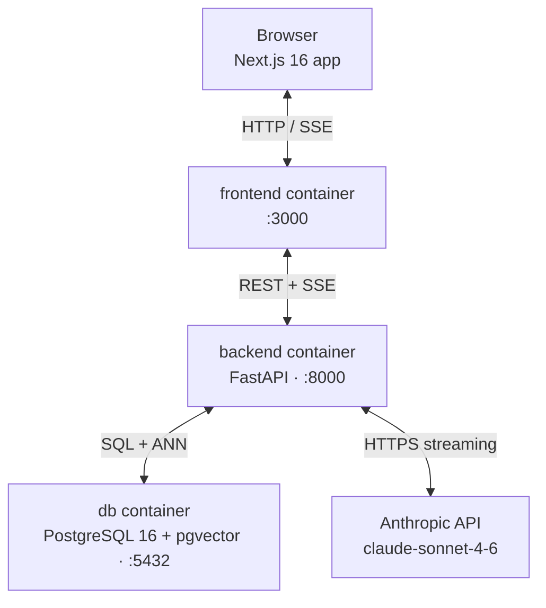
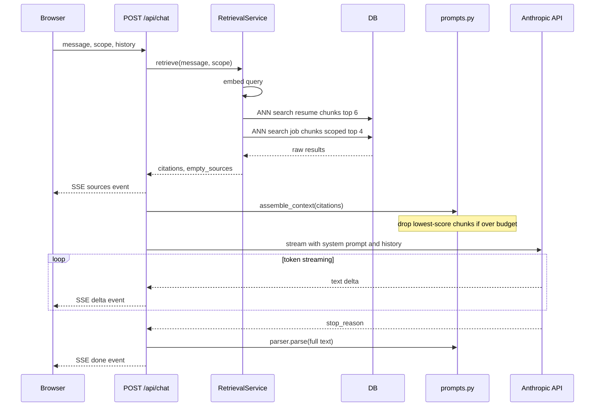

# Career Intelligence Assistant

Upload your resume and target job descriptions, ask the assistant how your experience aligns. Answers are grounded in your documents, and the model cannot invent skills or employers that do not appear in the text.

I built this because the retrieval problem in it is more interesting than it
looks. Answering "how do I fit this job" needs evidence from two different
documents at once, and the naive version, embed the question and take the top k
across everything, quietly fails: a 900-word job description produces more
chunks than a two-page resume, so top-k comes back with no resume passages at
all and the model fills the gap by inventing. Most of my thinking went into
making that failure impossible rather than unlikely.

## Quick start

```bash
cp .env.example .env       # or create .env manually, see SETUP.md
# set ANTHROPIC_API_KEY in .env
./build.sh
```

The browser opens automatically at `http://localhost:3000`. See [SETUP.md](./SETUP.md) for prerequisites and troubleshooting.

Upload a resume PDF and paste at least three job descriptions. Ask "which job am I the strongest fit for?" across all jobs, then switch to a single job and repeat: the citations change and the "Answering from…" line shows exactly what was read. Expand any citation chip to see the retrieved passage, its similarity score, and its location. Ask about a skill absent from your documents, and the assistant says what it found rather than inventing.

## Architecture



All three services are defined in `docker-compose.yml`. The frontend container does not call the Anthropic API or the database directly.



## How retrieval works

When a question arrives, the backend embeds it with the same BGE small model used at ingestion time. It then runs two separate cosine ANN searches: one against resume chunks (top 6 candidates) and one against job chunks (top 4 per job if scope is "all", or top 6 from a single job if a specific job is selected).

Results from both searches are filtered by a similarity floor, default 0.30 on a 0-1 cosine similarity scale. Chunks that score below the floor are discarded before the model sees them. Sources that produced zero passing chunks are noted explicitly in the context block so the model can say "no evidence found" rather than guessing.

Passing chunks are ranked by score. If they would exceed the 6,000-token context budget (estimated with `cl100k_base` as a proxy), the lowest-scoring chunks are dropped until the budget is met. The assembled context is injected into the system prompt alongside formatting rules; the conversation history is passed as the messages array. Retrieval always embeds the raw new message, and there is no query rewriting for follow-up phrasing.

## API

Full reference at `http://localhost:8000/docs`. Chat endpoint:

```bash
curl -X POST http://localhost:8000/api/chat -H "Content-Type: application/json" \
  -d '{"message":"What are my main gaps?","scope":"all","history":[]}'
```

SSE stream: `sources` before generation, `delta` frames with streaming text, then `done` with the parsed answer and billing metadata. On failure, `error` replaces `done`.

## Design decisions

**Two ANN queries instead of one.** This is the decision I would defend
hardest. Retrieval runs a separate filtered query per source with its own
budget, six chunks from the resume and six from the job in scope, rather than
one top-k over a mixed pool. A single query lets a verbose job description
crowd out the resume entirely, and the model then answers a question about the
candidate with no evidence about the candidate. Per-source budgets make that
outcome impossible by construction rather than unlikely in practice. It also
makes retrieval a pure function of (query, scope), which is testable with a
fake embedder and no database.

**Sync SQLAlchemy with asyncio.to_thread, not an async driver.** The only
endpoint that genuinely needs async is the SSE stream, and what it is waiting
on is the Anthropic API, not Postgres. Retrieval is two fast indexed queries.
Making the whole data layer async would have bought no measurable throughput
at this scale and cost real debugging time for no benefit. One async
endpoint, one `to_thread` call, and the rest of the codebase stays boring.

**No Alembic.** Table creation runs from SQLAlchemy metadata on startup and
`init.sql` enables pgvector. Migrations matter when a schema evolves against
data you cannot lose; this is a single-user demo where the reset path is
`docker compose down -v`. Adding Alembic would have meant a migration runner
to debug inside Docker and another failure mode on the path someone walks
first. In production it goes in on day one.

**Local embeddings instead of a hosted API.** bge-small-en-v1.5 runs in the
backend container. Two reasons: document content never leaves the deployment,
which matters for resumes and matters more in a regulated domain, and it means
this whole application runs with one API key instead of two. The `Embedder`
protocol exists precisely so that swapping to Voyage or OpenAI is a twenty-line
change if retrieval quality ever becomes the bottleneck.

## Engineering standards followed and skipped

Followed: strict api → services → repositories → db layering with no skipped layers; dependency injection through `__init__` on every service and repository; the `Embedder` protocol as the one permitted abstraction (tests inject a deterministic fake without mocking a network call); structured JSON logging with correlation IDs echoed in response headers; UUID primary keys and `timestamptz` everywhere; Python 3.11 fully annotated throughout.

Skipped intentionally, and documented: Alembic (the demo has no data to lose and the reset path is `docker compose down -v`); the async SQLAlchemy driver (the one endpoint that needs async waits on Claude, not Postgres); `httpx2` (the deprecation warning fires in tests but nothing is broken and the fix is a one-line swap).

Backend: pytest, hermetic: fake Embedder, mocked Anthropic client, route contract tests for every endpoint. Frontend: vitest component tests. SSE client and end-to-end browser flow are not covered by automated tests.

## How I used AI tools

Every backend session started with a standing ruleset, the same layering, naming, and error-handling rules that govern this codebase, loaded before any implementation prompt. Loading them up front meant the model didn't drift between sessions: it never suggested an async driver, never reached for a Manager class, never wrote a bare `except`. Consistent context produced consistent output.

Each task was handed over with a fixed template: the file to touch, the change to make, and the acceptance test. The model generated the implementation; I read every line before accepting it. Nothing was merged without that read. The things I did not delegate: the two-ANN-query retrieval design, the decision to cut the fit analysis rather than ship it half-finished, the system prompt, and the data model.

The pattern that paid off most: stating in advance what the model should not do. Explicit negative constraints, no Manager classes, no async driver, no bare except, no new abstraction without two concrete implementations to justify it, produced tighter code than reviewing for violations after the fact.

## Known limitations

1. **pypdf loses whitespace between layout columns.** Multi-column PDFs produce fused tokens ("LeadEngineer"). Fix: switch to `pdfplumber` or `pymupdf`.
2. **No authentication or user isolation.** Any HTTP client can read, upload, or delete any document. Fix: add an auth layer and a `user_id` FK on every table.
3. **Clearing the resume removes it from the UI only.** `clearResume()` updates local state; there is no `DELETE /api/resume`. Chunks remain indexed and continue to appear in citations.
4. **Follow-up questions are not rewritten for retrieval.** The retrieval query is the raw new message. Fix: add a query-rewriting step before embedding.
5. **The daily token budget resets to zero on container restart.** Fix: persist the counter in Redis or the database with a TTL keyed to the calendar day.
6. **Stopping generation does not cancel the server-side Claude API call.** The browser closes the SSE connection; Claude continues generating and the tokens are billed.
7. **Uploading the same resume twice creates two records.** No content hash or deduplication. Both are indexed; the model sees duplicate passages with different source labels.
8. **The context budget uses a proxy tokenizer.** `tiktoken` with `cl100k_base` diverges from Claude's tokenizer by roughly 5-15%.
9. **The 3-job limit is enforced by the frontend only.** A fourth job added via the API produces citations with a `kind` outside the `CitationKind` union type.
10. **Fit analysis fires one LLM call per job concurrently.** Three jobs means three Claude calls in parallel; each draws from the daily token budget.

## What I'd change with more time

In rough priority order.

**Query rewriting for follow-ups.** Retrieval embeds the question as typed.
Ask "what about the other one?" and it retrieves on those five words. I
mitigate it by prepending the previous user turn to the retrieval query, which
helps and does not solve it. The real fix is a cheap model call rewriting the
follow-up into a standalone question before embedding.

**A real evaluation harness.** I have unit tests proving retrieval honours its
budgets and its floor. I do not have anything proving the answers are good.
The next step is a golden set of (resume, JD, question, expected-signal) tuples
run on every prompt change, then LLM-as-judge for the subjective half.

**Hybrid retrieval.** Semantic only today. Job descriptions are full of exact
tokens, "Kubernetes", "FastAPI", "five years", where BM25 beats embeddings
outright. Reciprocal rank fusion over both would measurably improve skill-gap
answers.

**Better PDF extraction.** pypdf drops whitespace between some layout lines,
so "KOUSHA REZAEI" and "SENIOR ENGINEER" occasionally arrive concatenated.
It slightly degrades embedding quality and looks careless when you expand a
citation. A layout-aware parser would fix it.

**Evaluation harness for fit scores.** The fit analysis scores are grounded in
retrieved passages, but there is no golden set of (resume, JD, expected-score)
tuples verifying the scores are calibrated. An LLM-as-judge loop over a fixed
fixture set would catch prompt regressions before they reach production.

**Honest caveat on the whole architecture.** At this document scale, a
two-page resume and three job descriptions is a few thousand tokens, RAG is
arguably unnecessary. Injecting every document into a 200k context window
would be simpler and would give better answers today. I built retrieval
because it is the architecture that survives fifty job descriptions and
multi-page documents. But I would rather say that than pretend chunking was
obviously correct at this size.

## AWS productionisation sketch

ECS Fargate for both services (no Kubernetes-shaped problem, two stateless containers), RDS Postgres with pgvector Multi-AZ (same extension, nothing in the query layer changes), API keys in Secrets Manager, CloudFront in front of the Next.js app, ALB in front of the backend. The SSE endpoint needs the ALB idle timeout raised above the maximum expected generation time; the API must go direct to the ALB rather than through CloudFront, which buffers streaming responses and destroys the feature.

Two changes before this design could carry real traffic: embedding moves to SQS plus a worker (synchronous upload is fine for ten documents and wrong for a thousand, with the upload returning immediately and the UI polling for indexing status); and the schema needs a tenant id on every table with row-level security so a missed filter fails closed instead of leaking someone else's resume.

## About

**Kousha Rezaei**
kousharezae@gmail.com · [github.com/Koi725](https://github.com/Koi725) · [kousharezaei.dev](https://kousharezaei.dev)