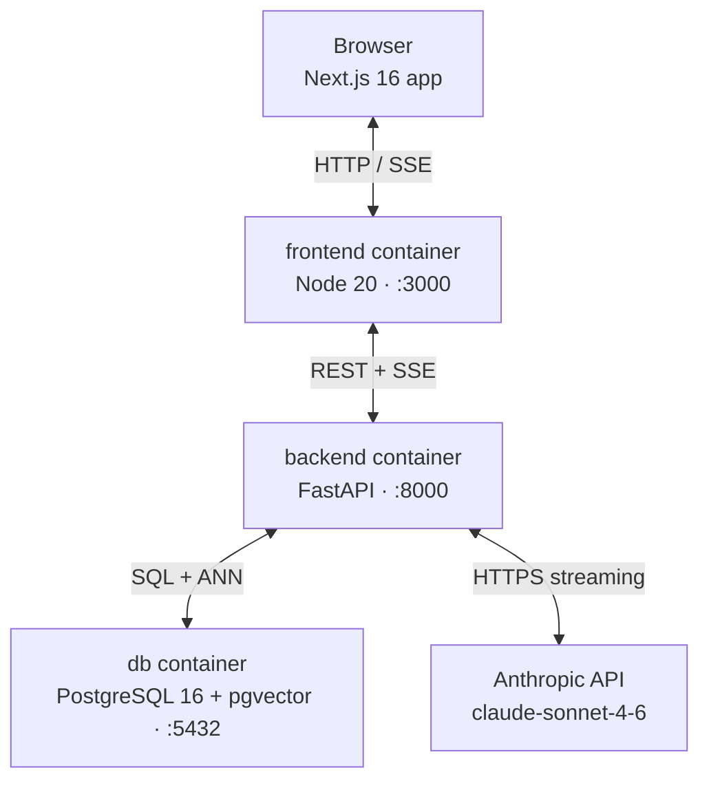
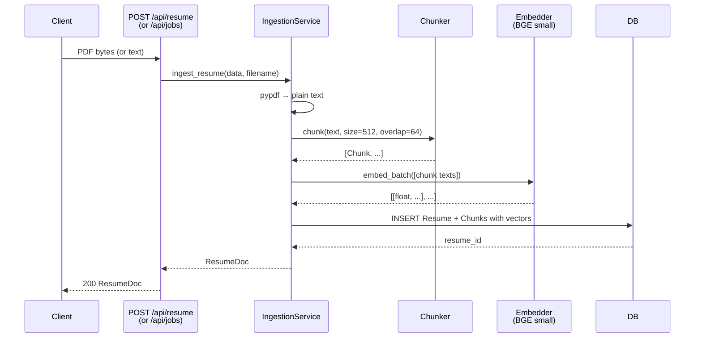
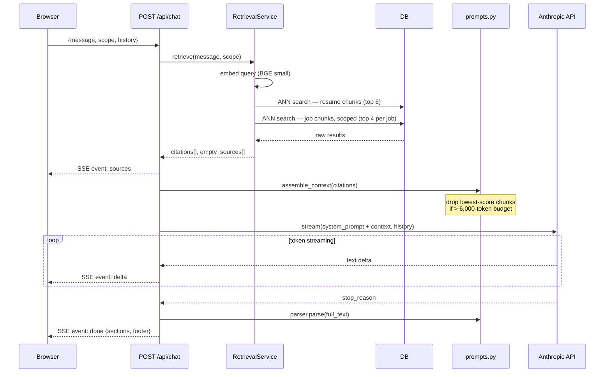
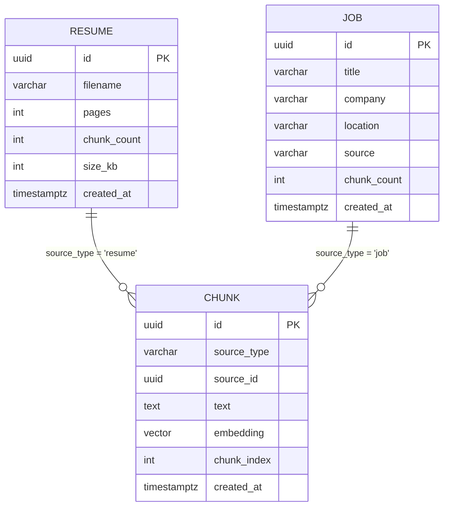

# Career Intelligence Assistant

A retrieval-augmented career companion: upload your resume and target job descriptions, then ask the assistant how your experience aligns. Answers are grounded exclusively in your documents — the model cannot invent skills or employers that do not appear in the text.

<!-- STUB: Kousha fills this in — one paragraph on the motivation and what you learned building it -->

## Quick start

```bash
cp .env.example .env       # or create .env manually — see SETUP.md
# set ANTHROPIC_API_KEY in .env
./build.sh
```

The browser opens automatically at `http://localhost:3000`. See [SETUP.md](./SETUP.md) for prerequisites and troubleshooting.

---

## Architecture

### System overview



All three services are defined in `docker-compose.yml`. The frontend container does not call the Anthropic API or the database directly.

### Ingestion sequence



### Chat sequence (SSE)



### Retrieval scoping


Two separate ANN queries are used deliberately: a single top-k over all chunks would return only job description text when the job description is long, leaving the model with no evidence about the candidate.

### Database schema



`source_type` + `source_id` is a soft foreign key. There is no enforced FK constraint — this keeps the delete path simple: the service deletes chunks by source, then deletes the parent row, both in the same transaction.

---

## API reference

| Method | Path | Description |
|--------|------|-------------|
| `POST` | `/api/resume` | Upload resume PDF |
| `POST` | `/api/jobs` | Add job (text or PDF) |
| `GET` | `/api/jobs` | List all jobs |
| `DELETE` | `/api/jobs/{id}` | Delete job and its chunks |
| `POST` | `/api/chat` | Stream chat response (SSE) |
| `GET` | `/health` | Liveness probe |
| `GET` | `/api/metrics` | In-process counters |

Interactive documentation: `http://localhost:8000/docs`

---

## Project structure

```
career-intelligence-assistant/
├── build.sh              one-command build, test, and launch
├── SETUP.md              prerequisites and troubleshooting
├── docker-compose.yml
├── .env                  (not committed — see SETUP.md)
├── backend/
│   ├── Dockerfile
│   ├── pyproject.toml
│   ├── README.md
│   └── app/              see backend/README.md
└── frontend/
    ├── README.md
    └── src/              see frontend/README.md
```

---

## Testing

### Backend

```bash
docker compose run --rm --no-deps backend sh -c "PYTHONPATH=/app pytest tests/ -q"
```

8 test files, hermetic (no live database, no real API calls). The `Embedder` protocol is faked with a deterministic implementation; the Anthropic client is mocked at the SDK boundary.

### Frontend

```bash
cd frontend && npm test
```

23 test files, 31 tests. Components with API dependencies use `vi.mock("@/lib/api")`. `DocumentsProvider` accepts an `initialJobs` prop to skip the `listJobs()` fetch in tests.

---

## Known limitations

These are real constraints with real consequences, not theoretical risks.

1. **pypdf loses whitespace between layout columns.** Multi-column PDF resumes are concatenated without spaces, producing fused tokens ("LeadEngineer" instead of "Lead Engineer"). Retrieval finds no matches for those fused tokens, so the model reports missing evidence for skills that are present in the document. Fix: switch to `pdfplumber` or `pymupdf`.

2. **No authentication or user isolation.** Any HTTP client can read, upload, or delete any document. A second browser tab shares state with the first because there is no user concept in the database schema. Fix: add an auth layer (e.g., Clerk) and a `user_id` FK on every table.

3. **Clearing the resume removes it from the UI only.** `clearResume()` updates local state; there is no `DELETE /api/resume` endpoint. The chunks remain indexed and are still retrieved and cited in subsequent chat turns even though the resume tile no longer appears in the sidebar.

4. **Follow-up questions are not rewritten for retrieval.** Conversation history is included in the prompt so the model has context, but the retrieval query is the raw new message. A follow-up like "what about their Python skills?" embeds as-is; the ANN search returns results for "Python skills" without knowing the conversation is about a specific job. Fix: add a query-rewriting step that expands the follow-up into a self-contained question before embedding.

5. **The daily token budget resets to zero on container restart.** The budget counter is a process-global Python integer with no persistence. After a restart the guard allows all requests until the new counter accumulates enough tokens to trip the limit. Fix: persist the counter in Redis or the database with a TTL keyed to the calendar day.

6. **Stopping generation does not cancel the server-side Claude API call.** When the user clicks Stop, the browser closes the SSE connection. The backend has no mechanism to cancel the in-flight Anthropic streaming request; Claude continues generating and the tokens are billed. Fix: pass an `asyncio.Event` through the streaming loop and check it after each delta.

7. **Uploading the same resume twice creates two separate records.** There is no content hash or deduplication check. Both records are indexed; the LLM sees duplicate passages with different source labels, which can produce contradictory or redundant citations.

8. **The context token budget uses a proxy tokenizer.** `tiktoken` with the `cl100k_base` encoding is used to estimate token counts. Claude uses a different tokenizer; actual counts differ by roughly 5–15%. The budget can silently over- or under-shoot, meaning the model may receive slightly more or less context than intended.

9. **The 3-job limit is enforced by the frontend only.** The backend accepts an unlimited number of jobs. If a fourth job is added by calling the API directly, its citations return `"Job 4"` as the `kind` field, which falls outside the `CitationKind` union type in `types.ts`. The citation chip renders without a colour class and the kind label is `undefined`.

10. **Fit analysis is not implemented.** The Fit screen shows an empty state. The backend has no analysis endpoint; the `FitAxis` and `FitCard` data shapes were prototype scaffolding and have been removed.

---

## AWS productionisation sketch

<!-- STUB: Kousha fills this in — your recommended architecture for a production deployment on AWS. Consider: ECS Fargate vs EKS, RDS for pgvector, Secrets Manager for the API key, CloudFront in front of the Next.js app, ALB for the backend, and how you'd handle the SSE streaming through an ALB idle timeout -->

---

## Design decisions

<!-- STUB: Kousha fills this in — the two or three choices you'd defend in a technical interview. e.g. why sync SQLAlchemy with asyncio.to_thread rather than an async driver, why no Alembic, why two ANN queries instead of one -->

---

## What I'd change with more time

<!-- STUB: Kousha fills this in — honest prioritised list. Show the reviewer you know where the rough edges are -->

---

## Evaluation notes

<!-- STUB: Kousha fills this in — anything the reviewer needs to know before running the app: test credentials, known flaky scenarios, what to try first -->

---

## About

<!-- STUB: Kousha fills this in — your name, contact, and any acknowledgements -->
